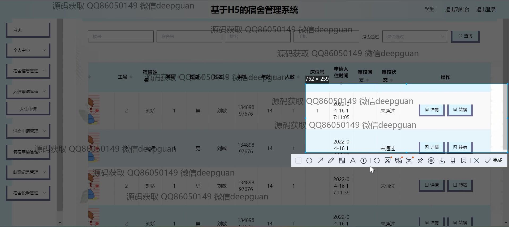
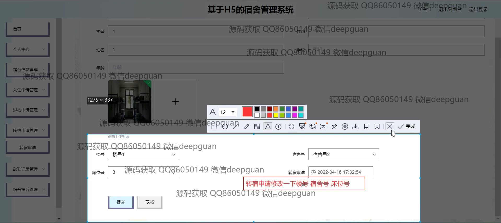

<h1 align="center">基于H的宿舍管理系统</h1>

## 简介
基于H5的宿舍管理系统：角色分为管理员、宿管；包括宿舍信息管理、入住及退宿申请、转宿申请、投诉管理及缺勤记录等功能模块，实现高效便捷的宿舍事务管理。    --计算机毕业设计源码；毕设源码；java毕业设计源码

## 联系方式

<h3 align="center">获取完整代码与数据库文件 + 微信：deepguan QQ: 86050149 QQ群: 783742310</h3>

<h3 align="center">可帮忙远程部署 包运行成功！提供远程部署、修改代码、设计文档指导、代码讲解等服务！</h3>

## 功能介绍（完整见运行截图）
管理员： 基本功能：登录和注册账号，查看和修改个人信息，退出登录 系统管理：管理宿舍楼号和宿舍号，查看和管理学生及宿舍信息 入住与退宿：处理入住申请，退宿申请，转宿申请 宿舍事务：管理宿舍投诉和公告，审批和记录投诉与公告 其它功能：上传图片，管理缺勤记录，查询和审核各类申请

宿管： 基本功能：登录和注册系统，查看和修改个人信息 宿舍管理：查看和管理宿舍号，学生信息，处理入住退宿申请 投诉处理：查看和管理宿舍投诉，上传和查看相关图片 其它功能：查看公告，记录缺勤信息

学生： 系统访问：通过身份验证后查看个人信息和宿舍信息 提交申请：申请入住，退宿，转宿并填写和修改个人信息 投诉：提交宿舍相关投诉，查看处理进度 其它功能：浏览公告，查看和管理个人信息以及上传个人相关图片

访客： 基本功能：访问系统登录页面 系统了解：了解系统功能和界面设计 提交申请：在获得权限后进行注册或申请宿舍相关事项 其它功能：退出登录，重新提交访问信息

## 运行截图

本代码来源于网络,仅供学习参考使用!

